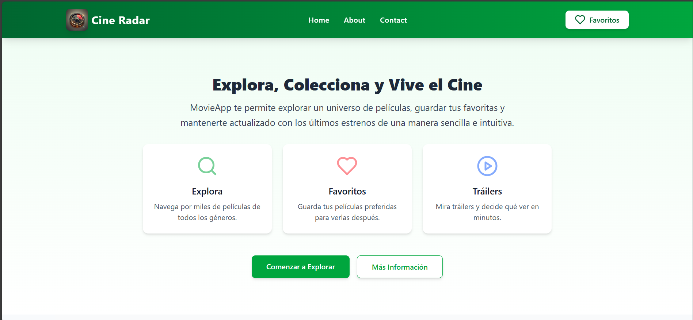

# 🎬 TMDB Movies App

TMDB Movies App es una aplicación web que consume la API de TMDB para mostrar películas populares, mejor valoradas y próximos estrenos. Los usuarios pueden explorar, buscar películas, añadirlas a favoritos y ver detalles y tráilers.

---

## 🚀 Tecnologías Utilizadas

- **React.js**
- **Vite**
- **Axios** (para peticiones HTTP)
- **React Toastify** (para notificaciones)
- **Lucide React** (para iconos)
- **Tailwind CSS** (para estilos)

---

## 📂 Estructura del Proyecto

```
📦 TMDB Movies App
├── 📁 src
│   ├── 📁 assets
│   ├── 📁 components
│   │   ├── 📁 layout
│   │   │   ├── Body.jsx
│   │   │   ├── Footer.jsx
│   │   │   ├── Header.jsx
│   │   ├── 📁 shared
│   │   │   ├── Button.jsx
│   │   │   ├── SearchBar.jsx
│   │   ├── 📁 ui
│   │   │   ├── FavoritesModal.jsx
│   │   │   ├── MovieCard.jsx
│   │   │   ├── MovieCategory.jsx
│   │   │   ├── Presentacion.jsx
│   │   │   ├── TrailerModal.jsx
│   ├── 📁 contexts
│   │   ├── FavoritesContext.jsx
│   │   ├── MoviesContext.jsx
│   ├── 📁 hooks
│   │   ├── useMovies.js
│   │   ├── useMoviesFavorites.js
│   │   ├── useMovieTrailer.js
│   ├── 📁 pages
│   │   ├── Home.jsx
│   ├── App.jsx
│   ├── index.css
│   ├── main.jsx
├── .env
├── package.json
├── README.md
```

---

## ✨ Características

✅ Visualización de películas por categorías: **Popular, Top Rated, Upcoming**
✅ Búsqueda de películas por título
✅ Sistema de favoritos para guardar películas
✅ Reproducción de tráilers
✅ Interfaz responsiva adaptada a diferentes dispositivos

---

## ⚙️ Configuración del Proyecto

### 1️⃣ Clonar el repositorio
```sh
 git clone [URL-del-repositorio]
 cd TMDB-Movies-App
```

### 2️⃣ Instalar dependencias
```sh
npm install
```

### 3️⃣ Configurar variables de entorno
Crea un archivo `.env` en la raíz del proyecto y agrega:
```sh
VITE_TMDB_BASE_URL=https://api.themoviedb.org/3
VITE_TMDB_KEY_API=[Tu_API_Key_de_TMDB]
VITE_TMDB_IMG_URL=https://image.tmdb.org/t/p/w500
```

### 4️⃣ Iniciar el servidor de desarrollo
```sh
npm run dev
```

---

## 🛠️ Componentes Principales

- **`Presentacion`**: Sección de presentación de la aplicación.
- **`MovieCategory`**: Muestra películas por categoría con opciones para limitar la cantidad mostrada.
- **`MovieCard`**: Tarjeta que muestra información básica de cada película.
- **`SearchBar`**: Barra de búsqueda para encontrar películas por título.
- **`FavoritesModal`**: Modal para gestionar películas favoritas.
- **`TrailerModal`**: Modal para ver tráilers de películas.

---

## 🎣 Hooks Personalizados

- **`useMovies`**: Maneja la obtención de películas desde la API.
- **`useMoviesFavorites`**: Gestiona las películas favoritas.
- **`useMovieTrailer`**: Maneja la obtención y reproducción de tráilers.

---

## 🎥 Capturas de Pantalla (Opcional)
_

---

## 🤝 Contribuciones
¡Las contribuciones son bienvenidas! Si deseas colaborar, por favor sigue estos pasos:
1. Haz un fork del repositorio.
2. Crea una nueva rama (`git checkout -b feature-nueva-funcionalidad`).
3. Realiza los cambios y haz commit (`git commit -m 'Añadir nueva funcionalidad'`).
4. Sube los cambios a tu fork (`git push origin feature-nueva-funcionalidad`).
5. Abre un Pull Request.

---

## 📜 Licencia
Este proyecto está bajo la licencia MIT. Consulta el archivo `LICENSE` para más información.

